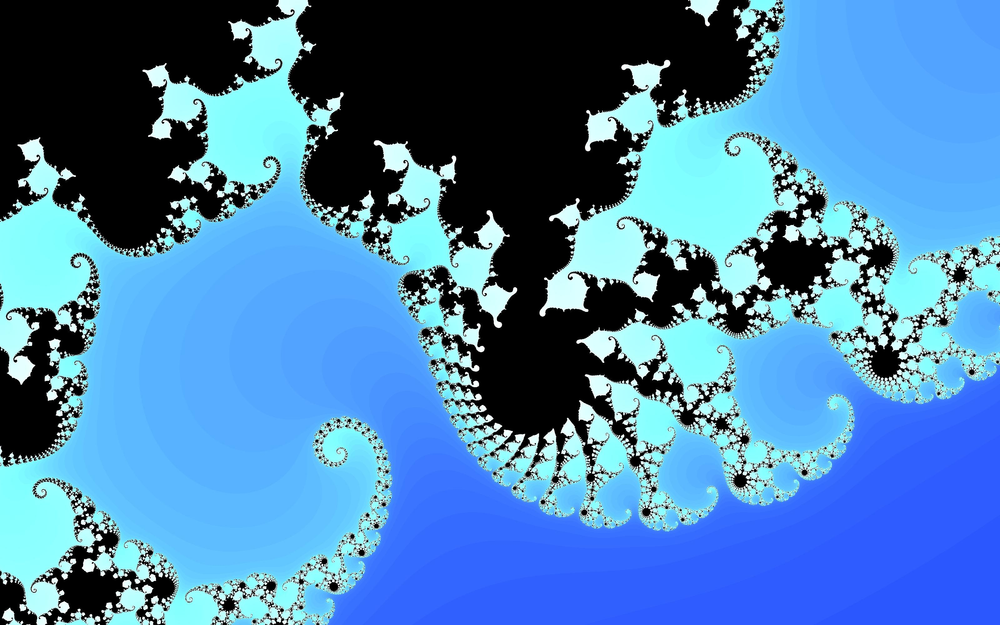

# FractalDX9

An old test project found in an old folder. Fun to use to generate fractals using the GPU and DirectX 9. No CUDA required. To compute a custom fractal, modify PixelShader.ps (HLSL format).

